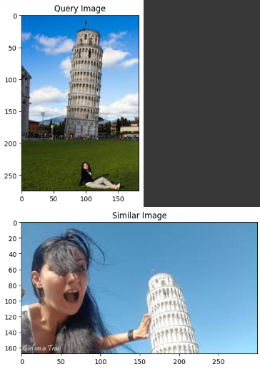
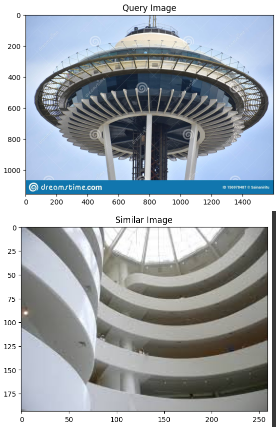

# Aggregating Local Descriptors Into a Compact Image Representation

## Introduction
This repository contains our VLAD (Vector of locally aggregated descriptors) implementations, reports, and experiment results for the mid-term project of Computer Vision (INT3412E 20) in VNU-UET.
## Description

## Contributors

This repository was made by three VNU-UET students:

[Nguyen Van An](https://github.com/annguyen3112)

[Do Minh Cuong](https://github.com/mcuongdo)

[Ha Manh Dung](https://github.com/manhdungne)

## Preview result

  

  

  

  

## Reference:
[Aggregating Local Descriptors Into a Compact Image Representation](https://sci-hub.hkvisa.net/10.1109/cvpr.2010.5540039)
